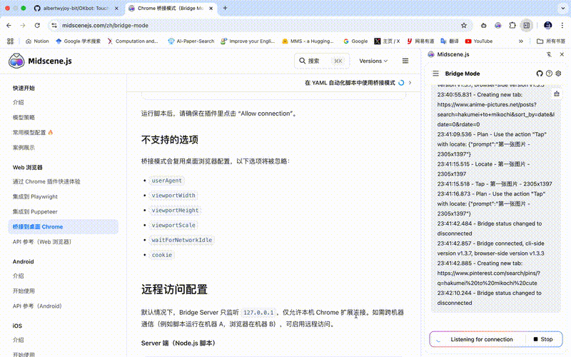

# OKbot - Kimi Feishu Integration

[](https://www.python.org/)
[](https://open.feishu.cn/)
[](https://opensource.org/licenses/Apache-2.0)

> **Touch Kimi CLI anywhere, anytime.**

**OKbot** 是基于 [Kimi Code CLI](https://github.com/MoonshotAI/kimi-cli) 的扩展项目，在原有 CLI 交互方式上增加了**移动端支持**。通过飞书与电脑上部署的 OKbot 实时交互，随时随地操控你的 PC。

## ✨ 核心优势

| 特性 | 说明 |
|------|------|
| 📱 **移动端扩展** | 在原有 CLI 基础上增加飞书移动端交互，手机即可操控 PC |
| 🔗 **完全复用** | 100% 复用 Kimi CLI 的 Session 机制和 OAuth 鉴权，无需额外配置 |
| 🔄 **跨端接续** | 支持 CLI ↔ 飞书无缝切换，任务随时随地带走 |
| 🛡️ **零冲突** | 可使用 `python -m kimi_cli` 运行，不与官方 Kimi CLI 冲突 |
| ⚡ **YOLO 模式** | **强制开启**，工具调用自动批准，无需人工确认 |
| 🔄 **动态 Skills** | 支持运行时热更新 Skills，无需重启服务 |
| 🔌 **实时通信** | 基于飞书 WebSocket 长连接，消息实时双向传输 |

> 🌟 **Forked from**: [MoonshotAI/kimi-cli](https://github.com/MoonshotAI/kimi-cli)

## 🎬 Showcase
通过飞书直接让 Kimi CLI 帮你完成各种任务！

### 富媒体文件处理


**演示场景**：用户在飞书中发送视频链接，OKbot 自动完成下载、压缩视频，并将处理后的文件发送回飞书。全程无需手动操作电脑，随时随地通过手机即可操控 PC。


### 操控 PC 浏览器

OKbot 可以连接用户电脑的 Chrome 浏览器，**复用用户的登录态（User Profile）**，通过飞书发送自然语言指令，在 PC 端自动操控浏览器完成网页操作。

**PC 端视角**：



**飞书端视角**：


**演示场景**：用户在飞书发送指令后，OKbot 在 PC 端控制浏览器自动执行网页操作（访问、点击、填表等），实时将执行进度汇报给飞书。浏览器复用用户已有的登录态，无需重新登录。


### 跨端 Session 接续

OKbot 支持**无缝切换 CLI 和飞书对话**，随时随地继续之前的会话。

**PC 端视角**（CLI 创建 Session）：


**飞书端视角**（移动端接续 Session）：


**使用流程**：

```bash
# 方式一：CLI → 飞书
# 1. 在电脑端创建 session
$ python -m kimi_cli.cli
# ... 对话中，session ID: abc123...

# 2. 在飞书查看可用 sessions
/sessions

# 3. 接续指定 session
/continue abc123
```

```bash
# 方式二：飞书 → CLI
# 1. 在飞书开始对话（自动创建 session）
# 2. 获取当前 session ID（会显示工作目录）
/id

# 3. 在 CLI 接续（必须在工作目录下）
$ cd <工作目录>                    # 重要！必须进入相同工作目录
$ python -m kimi_cli.cli --session <session_id>      # 接续 session

# 或者使用 --work-dir 参数指定工作目录
$ python -m kimi_cli.cli --session <session_id> --work-dir <工作目录>
```

**⚠️ 重要提示**：
- Feishu 和 CLI 的 session 存储在**工作目录**下的 `.kimi/sessions/` 中
- 接续时必须使用**相同的工作目录**，否则 CLI 找不到 session
- 使用 `/id` 命令可以查看当前 session 的完整信息（包括工作目录）

**可用命令**：

| 命令 | 说明 |
|------|------|
| `/sessions` | 列出所有可用的 CLI sessions |
| `/continue <id>` | 接续指定的 CLI session |
| `/session <id>` | 同 `/continue` |
| `/id` | 查看当前 session ID（用于 CLI 接续） |
| `/link` | 查看当前关联的 session |

**演示场景**：用户在电脑端使用 CLI 开始编写代码，临时需要外出，通过飞书 `/sessions` 查看可用会话，使用 `/continue` 接续之前的对话，在手机上继续完成任务。

## ✨ 主要特性

### 🤖 飞书深度集成
- **SDK WebSocket 长连接**：基于飞书官方 SDK，稳定接收和发送消息
- **消息实时响应**：支持群聊和私聊，自动回复用户消息
- **👌 OK 表情反馈**：收到消息时自动添加 👌 反应，表示已收到
- **富媒体支持**：支持图片、文件下载和处理

### ⚡ YOLO 模式（强制开启）
- **自动批准工具调用**：无需手动确认，直接执行所有工具操作
- **移动端优化**：适合手机操作，无需等待确认
- **专注效率**：省去反复确认的繁琐步骤，让 AI 自主完成任务

### 🛠️ MCP 工具生态
- **多 MCP 服务器支持**：可同时连接多个 MCP 服务器，工具名自动添加前缀避免冲突
  - `midscene-android__Tap` - Android 自动化测试
  - `midscene-web__Tap` - Web 自动化测试
  - `chrome-devtools__navigate_page` - Chrome 浏览器控制
  - `notion__API-post-page` - Notion 文档操作
  - `markitdown__convert_to_markdown` - 文件格式转换

### 🔐 OAuth 令牌自动刷新
- **智能令牌管理**：长对话场景下自动刷新 OAuth 令牌（每 60 秒检查一次）
- **双令牌体系**：
  - Feishu 租户令牌（2 小时有效期）
  - Kimi OAuth 令牌（30 分钟有效期）

### 🌐 Web 自动化测试（Midscene）
- **AI 驱动的 Web 自动化**：通过自然语言描述执行浏览器操作
- **支持 Chrome DevTools**：远程调试和控制浏览器
- **多端支持**：Web 端和 Android 端自动化测试

## 🚀 快速开始

### 环境要求

- **Python**: >= 3.12
- **Node.js**: >= 18 (用于 Midscene Web 自动化)
- **操作系统**: macOS / Linux / Windows

### 1. 克隆项目

```bash
git clone https://github.com/albertwyjoy-bit/OKbot.git
cd OKbot
```

### 2. 创建 Conda 环境

```bash
conda create -n okbot python=3.12 -y
conda activate okbot
```

### 3. 安装依赖

```bash
# Python 依赖
pip install -e ".[dev]"

# 飞书 SDK（必需）
pip install lark-oapi

# Node.js 依赖
pnpm install
```

### 4. 拉起服务

```bash
# 可以环境中仍保持官方的kimi命令，使用python拉起okbot
$ python -m kimi_cli.feishu
```

**注意**：对于 macOS 11.x 用户，esbuild 版本需锁定在 0.14.54（已在 package.json 中配置）

### 4. 飞书平台配置

#### 4.1 创建自建应用

1. 访问 [飞书开放平台](https://open.feishu.cn/app/) 并登录
2. 点击**创建应用** → 选择**企业自建应用**
3. 填写应用名称和描述，点击**创建**
4. 进入应用详情页，点击**凭证与基础信息**，获取 **App ID** 和 **App Secret**

#### 4.2 添加机器人能力

1. 在应用详情页，点击**添加能力与权限**
2. 找到**机器人**能力，点击**添加**
3. 设置机器人名称、头像和介绍

#### 4.3 配置必需权限

进入**权限管理** → **API 权限**，添加以下权限：

| 权限 | 说明 |
|------|------|
| `aily:message:write` | 发送消息 |
| `im:chat:readonly` | 获取群组信息 |
| `im:message` | 获取与发送单聊、群组消息 |
| `im:message.group_at_msg:readonly` | 接收群聊中@机器人消息事件 |
| `im:message.p2p_msg:readonly` | 读取用户发给机器人的单聊消息 |
| `im:message:readonly` | 获取单聊、群组消息 |
| `im:resource` | 获取与上传图片或文件资源 |

#### 4.4 配置事件订阅（⚠️ 关键步骤）

> **注意**：这是最容易被遗漏的配置！如果机器人能发送消息但无法接收消息，请检查此步骤。

1. 进入**事件与回调**页面
2. **订阅方式**：选择**长连接**（推荐）
3. 添加以下事件订阅：

| 事件 | 说明 |
|------|------|
| `im.message.receive_v1` | 接收消息（必需） |
| `im.message.message_read_v1` | 消息已读回执 |
| `im.chat.member.bot.added_v1` | 机器人被添加到群组 |
| `im.chat.member.bot.deleted_v1` | 机器人被移出群组 |

4. 点击**保存**，确认事件权限已申请

#### 4.5 发布应用

1. 进入**版本管理与发布**
2. 点击**创建版本**，填写版本号（如 1.0.0）和更新说明
3. 点击**保存并发布**

> **重要**：应用必须**发布**后，长连接才能正常建立。

#### 4.6 本地配置文件

创建 `~/.kimi/feishu.toml` 配置文件（可参考 `feishu.example.toml`）：

```toml
host = "127.0.0.1"
port = 18789
default_account = "bot"

# Skills 目录配置（可选，详见下方 Skills 配置说明）
# skills_dir = "~/.claude/skills"

[accounts.bot]
app_id = "cli_xxxxx"           # 替换为你的 App ID
app_secret = "xxxxxxxx"        # 替换为你的 App Secret
show_tool_calls = true         # 在消息中显示工具调用
show_thinking = true           # 在消息中显示思考过程
```

### 5. 安装 Midscene

本项目集成 [Midscene](https://midscenejs.com/zh/introduction.html) 实现 AI 驱动的 Web/Android 自动化测试。

**安装步骤**：

```bash
# 1. 安装 Midscene Web 依赖（已包含在 package.json 中）
pnpm install

# 2. 安装 Midscene Android MCP（全局安装）
npm install -g @midscene/android-mcp

# 3. 确保 Android SDK 环境变量已设置
export ANDROID_HOME="$HOME/Library/Android/sdk"
export PATH="$ANDROID_HOME/platform-tools:$PATH"
```

#### Chrome 桥接模式（推荐用于桌面浏览器自动化）

Midscene 支持通过 Chrome 插件实现桥接模式，无需额外安装 Playwright：

1. **安装 Chrome 插件**：
   - 下载 [Midscene Chrome 插件](https://chromewebstore.google.com/detail/midscene/gbldofopkkldkbgllfaodbaeadknajpa)
   - 或在 Chrome 应用商店搜索 "Midscene"

2. **启动桥接模式**：
   - 点击 Chrome 插件图标，选择 "Bridge Mode"
   - 或使用快捷键 `⇧ Shift + D` 快速启动

详细配置参考：https://midscenejs.com/zh/bridge-mode

**Midscene 文档参考**：https://midscenejs.com/zh/introduction.html

### 6. 配置 MCP 服务器

创建 `~/.kimi/mcp.json` 配置文件：

```json
{
  "mcpServers": {
    "chrome-devtools": {
      "command": "npx",
      "args": ["-y", "chrome-devtools-mcp@latest"]
    },
    "midscene-web": {
      "command": "npx",
      "args": ["-y", "@midscene/web-bridge-mcp"],
      "env": {
        "MIDSCENE_MODEL_BASE_URL": "https://api.example.com/v1",
        "MIDSCENE_MODEL_API_KEY": "your-api-key",
        "MIDSCENE_MODEL_NAME": "glm-4.6v",
        "MIDSCENE_MODEL_FAMILY": "glm-v",
        "MCP_SERVER_REQUEST_TIMEOUT": "600000"
      }
    },
    "midscene-android": {
      "command": "node",
      "args": ["$HOME/.nvm/versions/node/v22.22.0/lib/node_modules/@midscene/android-mcp/dist/index.js"],
      "env": {
        "MIDSCENE_MODEL_BASE_URL": "https://api.example.com/v1",
        "MIDSCENE_MODEL_API_KEY": "your-api-key",
        "MIDSCENE_MODEL_NAME": "glm-4.6v",
        "MIDSCENE_MODEL_FAMILY": "glm-v",
        "MCP_SERVER_REQUEST_TIMEOUT": "800000",
        "ANDROID_HOME": "$HOME/Library/Android/sdk",
        "PATH": "$HOME/Library/Android/sdk/platform-tools:/usr/local/bin:/usr/bin:/bin"
      }
    }
  }
}
```

**注意**：请将 `args` 中的路径修改为你实际的 `@midscene/android-mcp` 安装路径。

#### markitdown MCP 安装（可选）

如需使用文件格式转换功能，安装 markitdown-mcp：

```bash
# 创建独立的 markitdown 环境（推荐）
conda create -n markitdown python=3.12 -y
conda activate markitdown
pip install markitdown-mcp

# 然后在 mcp.json 中配置路径
# "command": "/path/to/anaconda3/envs/markitdown/bin/markitdown-mcp"
```

### 7. 启动服务

首次启动时会引导你完成 Kimi CLI 的登录验证：

```bash
# 使用启动脚本
./start-feishu.sh

# 或直接启动（可以在任意目录下启动，不会污染当前目录）
python -m kimi_cli.feishu
```

**注意**：服务可以在任意路径下启动，所有文件操作都会在隔离的工作目录中进行，不会污染启动目录。

首次运行时会显示登录链接，请在浏览器中完成授权。

#### 工作目录配置

默认情况下，所有文件会保存在 `~/.kimi/feishu-workspace/` 目录下。如需自定义工作目录，在 `~/.kimi/feishu.toml` 中配置：

```toml
# 自定义工作目录（可选，默认为 ~/.kimi/feishu-workspace/）
work_dir = "/path/to/your/workspace"
```

#### Skills 配置

Kimi CLI 支持通过 **Skills** 扩展功能。Skills 是放在特定目录下的文档，定义了如何使用特定工具或完成特定任务。

**配置 Skills 目录**（在 `~/.kimi/feishu.toml` 中）：

```toml
# 指定 skills 目录（可选，默认自动发现）
skills_dir = "~/.claude/skills"
```

如果不配置 `skills_dir`，系统会按以下顺序**自动发现** skills：

| 优先级 | 路径 | 说明 |
|--------|------|------|
| 1 | `~/.config/agents/skills/` | XDG 配置目录 |
| 2 | `~/.agents/skills/` | 隐藏目录 |
| 3 | `~/.kimi/skills/` | Kimi 专用目录 |
| 4 | `~/.claude/skills/` | Claude/Cursor 兼容目录 |
| 5 | `~/.codex/skills/` | Codex 兼容目录 |
| 6 | `{work_dir}/.agents/skills/` | 项目级 skills（工作目录下） |
| 7 | `{work_dir}/.kimi/skills/` | 项目级 Kimi skills |
| 8 | `{work_dir}/.claude/skills/` | 项目级 Claude skills |
| 9 | `{work_dir}/.codex/skills/` | 项目级 Codex skills |

**加载顺序**：内置 skills → 用户级 skills → 项目级 skills。后加载的同名 skill 会覆盖前面的。

**推荐做法**：
- **用户级 skills**：放在 `~/.claude/skills/`，全局可用
- **项目级 skills**：放在 `{work_dir}/.agents/skills/`，仅当前项目使用

**使用 Skill**：
```
/skill:skill-name 你的请求
```

例如：`/skill:mac-filesearch 查找最近修改的 PDF 文件`

### 8. 使用说明

#### Slash 命令

在飞书聊天中，支持以下 slash 命令：

| 命令 | 说明 |
|------|------|
| `/stop` | **打断当前操作**（类似 Ctrl+C，保留上下文） |
| `/clear` | 清除当前会话上下文，开始新的对话 |
| `/sessions` | **跨端接续** - 列出所有可用的 CLI sessions |
| `/continue <id>` | **跨端接续** - 接续指定的 CLI session |
| `/session <id>` | **跨端接续** - 同 `/continue` |
| `/id` | **跨端接续** - 查看当前 session ID（用于 CLI 接续） |
| `/link` | **跨端接续** - 查看当前关联的 session |
| `/mcp` | 查看当前可用的 MCP 工具列表 |
| `/help` | 显示帮助信息 |
| `/reset` | 重置当前会话（同 `/clear`） |
| `/update-skill` | 重新加载 Skills（新增/修改 skill 后使用） |

**打断操作**：
当机器人在执行长任务时，发送 `/stop` 即可立即打断，类似 CLI 中的 Ctrl+C。打断后上下文会保留，可以继续对话。

**注意**：
- `/sessions`, `/continue`, `/session`, `/id`, `/link` 等跨端接续命令由 Feishu 端直接处理
- `/yolo` 命令：OKbot 强制开启 YOLO 模式，此命令在 Feishu 端无效（仅影响 CLI 端）
- 其他 slash 命令（如 `/compact` 等）会透传给 Kimi CLI 处理

#### Skills 动态加载

支持在运行时动态加载新的 Skills，无需重启服务：

1. **添加新 Skill**：将 skill 文件夹放入 `~/.claude/skills/` 或 `{work_dir}/.agents/skills/`
2. **刷新 Skills**：在聊天中发送 `/update-skill`
3. **立即使用**：新 skill 通过 `/skill:name` 命令或对话中直接使用

`/update-skill` 命令会：
- 重新扫描所有 skills 目录
- 更新 system prompt 中的 skill 元信息
- 重新注册所有 `/skill:name` slash 命令
- 显示加载的 skills 列表

#### 文件传输

支持在飞书中直接发送文件和图片：
- 发送文件：机器人会下载并可以进一步处理
- 发送图片：机器人可以识别图片内容并回复
- 接收文件：机器人可以上传文件到飞书

## 🛠️ 开发指南

### 项目结构

```
OKbot/
├── src/kimi_cli/
│   ├── feishu/              # 飞书集成核心模块
│   │   ├── sdk_client.py    # 飞书 SDK 客户端
│   │   ├── sdk_server.py    # WebSocket 服务器
│   │   ├── config.py        # 配置管理
│   │   └── __main__.py      # 入口点
│   ├── cli/feishu.py        # CLI 命令
│   ├── tools/feishu/        # Feishu 工具
│   ├── auth/oauth.py        # OAuth 令牌管理
│   └── soul/toolset.py      # MCP 工具集
├── scripts/                 # 辅助脚本
├── docs/                    # 文档
└── tests/                   # 测试
```

### 常用命令

```bash
# 格式化代码
make format

# 运行检查
make check

# 运行测试
make test
```

## 🔧 高级配置

### Skills 加载机制详解

Skills 是扩展 Kimi CLI 功能的重要方式，系统按以下优先级加载：

```
加载顺序（后面的覆盖前面的同名 skill）：

1. 内置 Skills (kimi_cli/skills/)
   └── 随 Kimi CLI 一起分发的官方 skills

2. 用户级 Skills（按以下顺序查找，第一个存在的目录生效）
   ~/.config/agents/skills/
   ~/.agents/skills/
   ~/.kimi/skills/
   ~/.claude/skills/      ← 推荐，兼容 Claude/Cursor
   ~/.codex/skills/

3. 项目级 Skills（基于 work_dir，按以下顺序查找）
   {work_dir}/.agents/skills/    ← 推荐
   {work_dir}/.kimi/skills/
   {work_dir}/.claude/skills/
   {work_dir}/.codex/skills/
```

**使用 `--skills-dir` 覆盖**：

启动时可通过命令行参数强制指定 skills 目录（会跳过自动发现）：

```bash
# 只加载指定目录的 skills（内置 skills 仍然加载）
python -m kimi_cli.feishu --skills-dir /path/to/custom/skills
```

**创建自定义 Skill**：

每个 skill 是一个文件夹，包含 `SKILL.md` 文件：

```
~/.claude/skills/my-skill/
└── SKILL.md
```

`SKILL.md` 格式示例：

```markdown
---
name: my-skill
description: "当用户需要...时使用此 skill"
---

# Skill 标题

## 用法说明
...
```

### 代理设置

```bash
export HTTP_PROXY="http://127.0.0.1:7890"
export HTTPS_PROXY="http://127.0.0.1:7890"
export NO_PROXY="localhost,127.0.0.1"
```

### 日志级别

```bash
export KIMI_LOG_LEVEL=DEBUG  # DEBUG, INFO, WARNING, ERROR
```

## 🐛 常见问题

### Q: 启动时报 "Connection refused" 错误
A: 检查飞书应用是否正确配置了事件订阅，确保 WebSocket 端口可访问。

### Q: MCP 工具名称冲突
A: 本项目已自动为 MCP 工具添加 `{server}__{tool}` 前缀，如 `midscene-web__Tap`。

### Q: OAuth 401 错误
A: 长对话中令牌可能过期，代码已自动处理刷新，如仍有问题请检查系统时间同步。

### Q: Midscene Android 连接失败
A: 请确保：
1. Android 设备已启用开发者模式和 USB 调试
2. `adb devices` 能识别到设备
3. `ANDROID_HOME` 环境变量已正确设置

## 📚 相关链接

- [Midscene 官方文档](https://midscenejs.com/zh/introduction.html)
- [飞书开放平台](https://open.feishu.cn/)
- [Kimi Code CLI](https://github.com/MoonshotAI/kimi-cli)

## 📝 更新日志

详见 [CHANGELOG.md](./CHANGELOG.md)

## 📄 许可证

本项目基于 [Apache License 2.0](LICENSE) 开源。

原始项目 [MoonshotAI/kimi-cli](https://github.com/MoonshotAI/kimi-cli) 版权归 Moonshot AI 所有。
