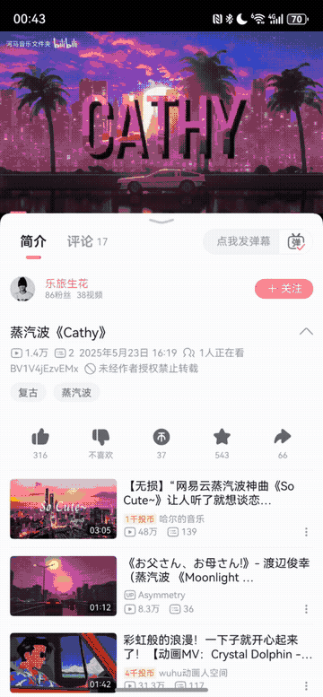
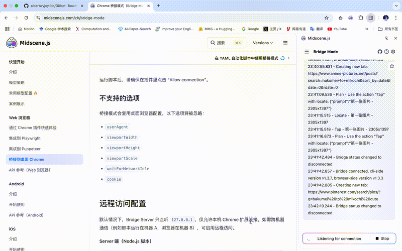
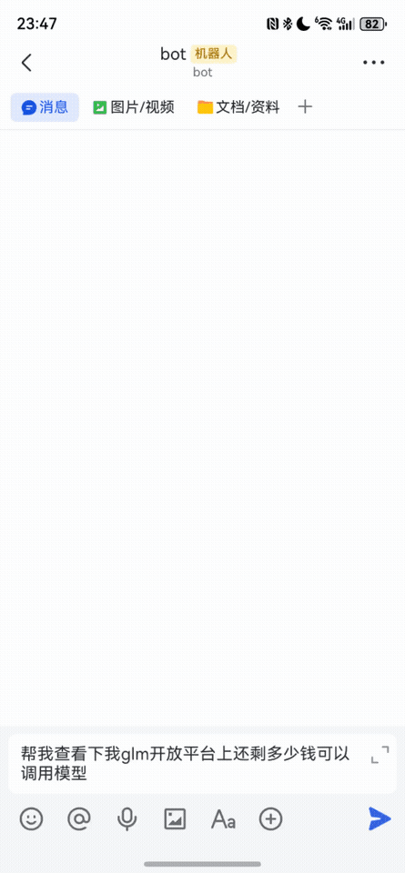

# OKbot - Kimi Feishu Integration

[](https://www.python.org/)
[](https://github.com/MoonshotAI/kimi-cli)
[](https://open.feishu.cn/)
[](https://opensource.org/licenses/Apache-2.0)

> **Touch Kimi CLI anywhere, anytime.**

**OKbot** 是 [Kimi Code CLI](https://github.com/MoonshotAI/kimi-cli) 的飞书扩展版本，让你**通过飞书与 Kimi CLI 实时交互**，随时随地操控 PC 和 Android 设备。完全复用 Kimi CLI 的 Session 机制，支持 CLI ↔ 飞书无缝切换，任务随时可以带走继续。同时支持动态 Skills 热更新，边用边写，无需重启。

## ✨ 核心优势

| 特性 | 说明 |
|------|------|
| 🕐 **定时任务** | **重磅新功能！** 支持 Cron 表达式创建定时任务，Agent 智能执行或定时提醒，支持文件自动生成与引用 |
| 🔄 **跨端接续** | 100% 复用 Kimi CLI 机制，CLI 上开发到一半随时切飞书继续，任务随时带走 |
| 🛠️ **动态 Skills** | 飞书中随时让 AI 帮你写 Skills，热更新立即生效，边用边迭代 |
| 🔄 **MCP 热更新** | 运行时动态添加/删除/修改 MCP 服务器配置，无需重启立即生效 |
| ✅ **灵活授权模式** | 支持 YOLO 自动批准（默认）和交互式卡片授权两种模式，发送 `/yolo` 随时切换 |
| 🎤 **语音消息** | 支持飞书语音消息，使用智谱 ASR 自动识别为文字，随时随地语音操控 |
| 💬 **富媒体交互** | 支持图片、文件收发；移动端直接操控 PC，双向实时通信 |
| 🤖 **设备操控** | 支持控制 PC 浏览器（Chrome）和 Android 手机，通过自然语言指令操作 |
| 🔧 **MCP 工具隔离** | 多 MCP 服务器场景下自动添加 `{server}__` 前缀，彻底解决工具重名冲突问题 |

> 🌟 **Forked from**: [MoonshotAI/kimi-cli](https://github.com/MoonshotAI/kimi-cli)

## 🎬 Showcase

通过飞书直接让 Kimi CLI 帮你完成各种任务！

### 富媒体文件处理



**演示场景**：用户在飞书中发送视频链接，OKbot 自动完成下载、压缩视频，并将处理后的文件发送回飞书。全程无需手动操作电脑，随时随地通过手机即可操控 PC。

### 操控 PC 浏览器

OKbot 可以连接用户电脑的 Chrome 浏览器，**复用用户的登录态（User Profile）**，通过飞书发送自然语言指令，在 PC 端自动操控浏览器完成网页操作。

**PC 端视角**：



**飞书端视角**：



**演示场景**：用户在飞书发送指令后，OKbot 在 PC 端控制浏览器自动执行网页操作（访问、点击、填表等），实时将执行进度汇报给飞书。浏览器复用用户已有的登录态，无需重新登录。

### 跨端 Session 接续

OKbot 支持**无缝切换 CLI 和飞书对话**，随时随地继续之前的会话。

**PC 端视角**（CLI 创建 Session）：


**飞书端视角**（移动端接续 Session）：


**使用流程**：

```bash
# 方式一：CLI → 飞书
# 1. 在电脑端创建 session
$ python -m kimi_cli.cli
# ... 对话中，session ID: abc123...

# 2. 在飞书查看可用 sessions
/sessions

# 3. 接续指定 session
/continue abc123
```

```bash
# 方式二：飞书 → CLI
# 1. 在飞书开始对话（自动创建 session）
# 2. 获取当前 session ID（会显示工作目录）
/id

# 3. 在 CLI 接续（必须在工作目录下）
$ cd <工作目录>                    # 重要！必须进入相同工作目录
$ python -m kimi_cli.cli --session <session_id>      # 接续 session

# 或者使用 --work-dir 参数指定工作目录
$ python -m kimi_cli.cli --session <session_id> --work-dir <工作目录>
```

**⚠️ 重要提示**：
- Feishu 和 CLI 的 session 存储在**工作目录**下的 `.kimi/sessions/` 中
- 接续时必须使用**相同的工作目录**，否则 CLI 找不到 session
- 使用 `/id` 命令可以查看当前 session 的完整信息（包括工作目录）

**可用命令**：

| 命令 | 说明 |
|------|------|
| `/sessions` | 列出所有可用的 CLI sessions |
| `/continue <id>` | 接续指定的 CLI session |
| `/session <id>` | 同 `/continue` |
| `/id` | 查看当前 session ID（用于 CLI 接续） |
| `/link` | 查看当前关联的 session |

**演示场景**：用户在电脑端使用 CLI 开始编写代码，临时需要外出，通过飞书 `/sessions` 查看可用会话，使用 `/continue` 接续之前的对话，在手机上继续完成任务。

### 定时任务（Scheduled Tasks）🕐

OKbot 现在支持强大的**定时任务功能**，让你可以设置周期性任务，由 AI 自动执行或定时发送提醒。

**功能亮点**：
- 🕐 **双模式支持**：智能任务执行（Agent 处理）或简单定时提醒
- 📝 **自然语言创建**：用自然语言描述时间，AI 自动转换为 Cron 表达式
- 📁 **文件自动生成**：任务生成的文件自动上传到飞书，引用卡片时可读取内容
- ⏱️ **灵活的 Cron 表达式**：支持 5字段（分钟级）和 6字段（秒级）Cron 表达式

**使用示例**：

```
# 方式一：使用 /cron 命令
/cron add "0 9 * * *" "每天早上9点生成昨日数据报告"

# 方式二：使用自然语言（Agent 工具）
"每30分钟提醒我喝水"
"每周一上午9点生成周报并发送给我"
```

**命令列表**：

| 命令 | 说明 |
|------|------|
| `/cron help` | 显示定时任务帮助信息 |
| `/cron list` | 列出当前对话的所有定时任务 |
| `/cron add "表达式" "描述"` | 创建新的定时任务 |
| `/cron remove <id>` | 删除指定的定时任务 |
| `/cron toggle <id>` | 暂停/启用指定的定时任务 |
| `/cron history [id]` | 查看任务执行历史 |
| `/cron trigger <id>` | 立即触发任务（测试用）|

**Cron 表达式格式**：

```
# 5字段格式（分钟级）：分 时 日 月 周
0 9 * * *       # 每天上午9点
0 9 * * 1       # 每周一上午9点
*/30 * * * *    # 每30分钟

# 6字段格式（秒级）：秒 分 时 日 月 周
*/5 * * * * *   # 每5秒执行一次
0 * * * * *     # 每分钟的第0秒执行
```

**双模式说明**：

1. **智能任务模式**（默认）：设置 `task_description`，定时触发时调用 Agent 执行复杂任务
   - 示例：生成报告、分析数据、检查日志等

2. **提醒模式**：设置 `reminder_text`，定时直接发送提醒消息（不经过 Agent）
   - 示例：喝水提醒、会议提醒等

> 📖 详细文档：[docs/scheduler_file_handling.md](./docs/scheduler_file_handling.md)

## ✨ 主要特性

### 🤖 飞书深度集成
- **SDK WebSocket 长连接**：基于飞书官方 SDK，稳定接收和发送消息
- **消息实时响应**：支持群聊和私聊，自动回复用户消息
- **👌 OK 表情反馈**：收到消息时自动添加 👌 反应，表示已收到
- **富媒体支持**：支持图片、文件下载和处理
- **🎤 语音消息识别**：支持飞书语音消息，使用 GLM-ASR-2512 自动识别为文字

### ⚡ 灵活授权模式（YOLO / 交互式卡片）

OKbot 支持两种工具授权模式，通过 `/yolo` 命令随时切换：

**YOLO 模式（默认）**：
- **自动批准工具调用**：无需手动确认，直接执行所有工具操作
- **移动端优化**：适合手机操作，无需等待确认
- **专注效率**：省去反复确认的繁琐步骤，让 AI 自主完成任务

**交互式卡片授权模式**：
- **精细控制**：每个工具调用都通过卡片展示，可选择「允许一次」「始终允许」或「拒绝」
- **安全可靠**：敏感操作需要人工确认，避免误操作
- **灵活切换**：发送 `/yolo` 随时在两种模式间切换

### 🛠️ MCP 工具生态
- **多 MCP 服务器支持**：可同时连接多个 MCP 服务器，工具名自动添加 `{server}__` 前缀彻底解决重名冲突
  - `midscene-android__Tap` / `midscene-web__Tap` - 解决多服务器 `Tap` 工具冲突
  - `chrome-devtools__navigate_page` - Chrome 浏览器控制
  - `notion__API-post-page` - Notion 文档操作
  - `markitdown__convert_to_markdown` - 文件格式转换
- **MCP 热更新**：运行时动态添加/删除/修改 MCP 服务器配置，无需重启立即生效（修改 `~/.kimi/mcp.json` 后执行 `/update-mcp` 命令）
- **智能工具隔离**：同名工具在不同服务器间自动隔离，AI 精准调用无混淆

### 🔐 OAuth 令牌自动刷新
- **智能令牌管理**：长对话场景下自动刷新 OAuth 令牌（每 60 秒检查一次）
- **双令牌体系**：
  - Feishu 租户令牌（2 小时有效期）
  - Kimi OAuth 令牌（30 分钟有效期）

### 🌐 Web 自动化测试（Midscene）
- **AI 驱动的 Web 自动化**：通过自然语言描述执行浏览器操作
- **支持 Chrome DevTools**：远程调试和控制浏览器
- **多端支持**：Web 端和 Android 端自动化测试

---

## 🚀 快速安装（推荐）

使用交互式安装脚本一键完成环境配置：

```bash
# 1. 克隆项目
git clone https://github.com/albertwyjoy-bit/OKbot.git
cd OKbot

# 2. 运行安装脚本
./install.sh
```

安装脚本会自动完成：
- ✅ 检测 Python 3.12+、Conda/Mamba、Node.js、Git
- ✅ 创建 Conda 虚拟环境 (`okbot`)
- ✅ 安装 Python 和 Node.js 依赖
- ✅ 配置智谱 API Key（可选，用于语音和图像理解）
- ✅ 配置飞书应用凭证
- ✅ 配置 MCP 服务器（chrome-devtools、midscene-web/android、markitdown、notion）

安装完成后，根据提示启动服务即可。


## 🛠️ 手动安装步骤

按照以下步骤，一步步完成 OKbot 的部署和配置。


### 📋 前置要求

| 项目 | 版本要求 | 用途 |
|------|----------|------|
| Python | >= 3.12 | 运行 OKbot 主程序 |
| Node.js | >= 18 | Midscene Web 自动化 |
| 操作系统 | macOS / Linux / Windows | 兼容主流桌面系统 |


### 步骤 1：克隆项目 & 安装依赖

```bash
# 1. 克隆项目
git clone https://github.com/albertwyjoy-bit/OKbot.git
cd OKbot

# 2. 创建 Conda 环境
conda create -n okbot python=3.12 -y
conda activate okbot

# 3. 安装 Python 依赖
pip install -e ".[dev]"
pip install lark-oapi  # 飞书 SDK（必需）

# 4. 安装 Node.js 依赖
pnpm install
```

> **注意**：对于 macOS 11.x 用户，esbuild 版本需锁定在 0.14.54（已在 package.json 中配置）

---

### 步骤 2：申请 API Key（推荐）

#### 2.1 智谱 AI API Key（推荐，用于语音和图像理解）

用于语音消息识别（ASR）和 Midscene 的图像理解能力。

- **申请地址**：https://open.bigmodel.cn/
- **操作步骤**：
  1. 注册/登录智谱 AI 开放平台
  2. 进入「API Keys」页面
  3. 创建新的 API Key
- **模型支持**：GLM-4V（图像理解）、GLM-ASR-2512（语音识别）

#### 2.2 飞书应用凭证（必需）

后面步骤会详细说明如何创建飞书应用并获取 App ID 和 App Secret。

#### 2.3 Kimi Code Plan（推荐）

OKbot 基于 Kimi Code CLI，推荐使用 Kimi Code Plan。

- **开通地址**：https://kimi.com/code
- **配置方式**：首次启动时会自动引导完成 OAuth 设备授权，无需手动申请 API Key
- **工作原理**：使用 OAuth 设备授权流程，会打开浏览器让你登录 Kimi 账号并授权

---

### 步骤 3：创建飞书应用并获取凭证

飞书应用是 OKbot 与飞书通信的桥梁，必须完成以下配置才能让机器人正常工作。

#### 3.1 创建自建应用

1. 访问 [飞书开放平台](https://open.feishu.cn/app/) 并登录
2. 点击**创建应用** → 选择**企业自建应用**
3. 填写应用名称和描述，点击**创建**
4. 进入应用详情页，点击**凭证与基础信息**，获取 **App ID** 和 **App Secret**

#### 3.2 添加机器人能力

1. 在应用详情页，点击**添加能力与权限**
2. 找到**机器人**能力，点击**添加**
3. 设置机器人名称、头像和介绍

#### 3.3 配置必需权限

进入**权限管理** → **API 权限**，添加以下权限：

| 权限 | 说明 |
|------|------|
| `aily:message:write` | 发送消息 |
| `im:chat:readonly` | 获取群组信息 |
| `im:message` | 获取与发送单聊、群组消息 |
| `im:message.group_at_msg:readonly` | 接收群聊中@机器人消息事件 |
| `im:message.p2p_msg:readonly` | 读取用户发给机器人的单聊消息 |
| `im:message:readonly` | 获取单聊、群组消息 |
| `im:resource` | 获取与上传图片或文件资源 |

#### 3.4 配置事件订阅（⚠️ 关键步骤）

> **注意**：这是最容易被遗漏的配置！如果机器人能发送消息但无法接收消息或点击卡片无反应，请检查此步骤。

**订阅方式**：选择**长连接**（推荐），所有事件和回调都通过 WebSocket 长连接接收，无需配置 HTTP 回调地址。

##### 3.4.1 事件配置

用于接收消息、群组变更等系统事件：

1. 进入**事件与回调**页面
2. 在「事件配置」部分添加以下事件订阅：

| 事件 | 说明 |
|------|------|
| `im.message.receive_v1` | 接收消息（必需） |
| `im.message.message_read_v1` | 消息已读回执 |
| `im.chat.member.bot.added_v1` | 机器人被添加到群组 |
| `im.chat.member.bot.deleted_v1` | 机器人被移出群组 |

##### 3.4.2 回调配置

用于接收卡片按钮点击等交互式回调：

1. 在「回调配置」部分添加以下回调：

| 回调 | 说明 |
|------|------|
| `card.action.trigger` | **卡片回传交互**（必需，用于交互式授权卡片） |

2. 点击**保存**，确认事件权限已申请

> **关于 `card.action.trigger`**：当关闭 YOLO 模式后，用户需要通过点击卡片按钮来批准/拒绝工具调用。如果未订阅此回调，卡片按钮将无响应。此回调同样通过长连接接收，无需 HTTP 回调地址。

#### 3.5 发布应用

1. 进入**版本管理与发布**
2. 点击**创建版本**，填写版本号（如 1.0.0）和更新说明
3. 点击**保存并发布**

> **重要**：应用必须**发布**后，长连接才能正常建立。

#### 3.6 创建本地配置文件

创建 `~/.kimi/feishu.toml` 配置文件（可参考项目中的 `feishu.example.toml`）：

```toml
host = "127.0.0.1"
port = 18789
default_account = "bot"

# Skills 目录配置（可选，详见下方 Skills 配置说明）
# skills_dir = "~/.claude/skills"

[accounts.bot]
app_id = "cli_xxxxx"           # 替换为你的 App ID
app_secret = "xxxxxxxx"        # 替换为你的 App Secret
show_tool_calls = true         # 在消息中显示工具调用
show_thinking = true           # 在消息中显示思考过程
auto_approve = true            # 默认启用 YOLO 自动批准模式（可通过 /yolo 命令切换）

# 语音消息识别（可选，见步骤 5）
# asr_api_key = "your-zhipu-api-key"
```

---

### 步骤 4：安装并配置 MCP 服务器（可选但推荐）

MCP 服务器扩展了 OKbot 的能力，使其能够控制浏览器、操作 Android 设备等。

#### 4.1 安装 Midscene Android MCP（可选）

如需控制 Android 设备，执行以下安装：

```bash
# 全局安装 Midscene Android MCP
npm install -g @midscene/android-mcp

# 确保 Android SDK 环境变量已设置
export ANDROID_HOME="$HOME/Library/Android/sdk"
export PATH="$ANDROID_HOME/platform-tools:$PATH"
```

#### 4.2 安装 Midscene Chrome 插件（推荐）

Midscene 支持通过 Chrome 插件实现桥接模式，用于桌面浏览器自动化：

1. **安装 Chrome 插件**：
   - 下载 [Midscene Chrome 插件](https://chromewebstore.google.com/detail/midscene/gbldofopkkldkbgllfaodbaeadknajpa)
   - 或在 Chrome 应用商店搜索 "Midscene"

2. **启动桥接模式**：
   - 点击 Chrome 插件图标，选择 "Bridge Mode"
   - 或使用快捷键 `⇧ Shift + D` 快速启动

详细配置参考：https://midscenejs.com/zh/bridge-mode

#### 4.3 创建 MCP 配置文件

创建 `~/.kimi/mcp.json` 配置文件：

```json
{
  "mcpServers": {
    "chrome-devtools": {
      "command": "npx",
      "args": ["-y", "chrome-devtools-mcp@latest"]
    },
    "midscene-web": {
      "command": "npx",
      "args": ["-y", "@midscene/web-bridge-mcp"],
      "env": {
        "MIDSCENE_MODEL_BASE_URL": "https://open.bigmodel.cn/api/paas/v4",
        "MIDSCENE_MODEL_API_KEY": "your-zhipu-api-key",
        "MIDSCENE_MODEL_NAME": "glm-4v-plus",
        "MIDSCENE_MODEL_FAMILY": "glm-v",
        "MCP_SERVER_REQUEST_TIMEOUT": "600000"
      }
    },
    "midscene-android": {
      "command": "node",
      "args": ["$HOME/.nvm/versions/node/v22.22.0/lib/node_modules/@midscene/android-mcp/dist/index.js"],
      "env": {
        "MIDSCENE_MODEL_BASE_URL": "https://open.bigmodel.cn/api/paas/v4",
        "MIDSCENE_MODEL_API_KEY": "your-zhipu-api-key",
        "MIDSCENE_MODEL_NAME": "glm-4v-plus",
        "MIDSCENE_MODEL_FAMILY": "glm-v",
        "MCP_SERVER_REQUEST_TIMEOUT": "800000",
        "ANDROID_HOME": "$HOME/Library/Android/sdk",
        "PATH": "$HOME/Library/Android/sdk/platform-tools:/usr/local/bin:/usr/bin:/bin"
      }
    }
  }
}
```

**配置说明**：
- 将 `your-zhipu-api-key` 替换为步骤 2.1 中申请的智谱 API Key
- Midscene 使用多模态模型进行图像理解，需要配置视觉模型 API
- 请将 `args` 中的路径修改为你实际的 `@midscene/android-mcp` 安装路径（如果安装了的话）

#### 4.4 安装 markitdown MCP（可选）

如需使用文件格式转换功能：

```bash
# 创建独立的 markitdown 环境（推荐）
conda create -n markitdown python=3.12 -y
conda activate markitdown
pip install markitdown-mcp

# 然后在 mcp.json 中添加配置（路径根据实际安装位置调整）
```

#### 4.5 MCP 热更新（运行时配置变更）

OKbot 支持在不重启服务的情况下动态更新 MCP 配置：

**使用场景**：
- 新增 MCP 服务器
- 修改现有 MCP 服务器配置
- 删除 MCP 服务器
- 临时禁用/启用某个 MCP 服务器

**操作方式**：
1. 编辑 `~/.kimi/mcp.json` 配置文件
2. 在飞书对话中发送 `/update-mcp` 命令
3. 系统会自动检测配置变更并热更新，无需重启服务

**热更新特性**：
- ✅ 新增服务器：自动连接并加载工具
- ✅ 删除服务器：自动断开连接并清理工具
- ✅ 修改配置：自动重启对应服务器
- ✅ 工具隔离：保持 `{server}__` 前缀机制

---

### 步骤 5：配置语音消息识别（可选）

OKbot 支持接收飞书语音消息并自动识别为文字，使用智谱 GLM-ASR-2512 模型，中文识别效果优秀。

**前置条件**：已完成步骤 2.1 申请智谱 API Key

**配置方法**（选择一种）：

**方式一：环境变量（推荐）**
```bash
export ZHIPU_API_KEY="your-zhipu-api-key"
```

**方式二：配置文件**
在 `~/.kimi/feishu.toml` 中添加：
```toml
[accounts.bot]
app_id = "cli_xxxxx"
app_secret = "xxxxxxxx"
asr_api_key = "your-zhipu-api-key"
```

**使用语音功能**：
- 在飞书对话中按住麦克风图标说话
- OKbot 会自动识别语音并回复

> 📖 详细文档：[docs/voice-messages.md](./docs/voice-messages.md)

---

### 步骤 6：启动服务并验证

完成以上所有配置后，启动 OKbot 服务：

```bash
python -m kimi_cli.feishu
```

**首次运行**：
- 会显示 Kimi OAuth 登录链接，请在浏览器中完成授权
- 授权成功后，服务就会正常启动

**验证步骤**：
1. 在飞书中找到你的机器人（搜索应用名称）
2. 发送一条文本消息，确认机器人能回复
3. 测试文件传输：发送一张图片或文件
4. 测试语音（如果配置了）：发送语音消息

**查看可用命令**：
在飞书对话中发送 `/help` 查看所有支持的命令。

---

## 📖 使用说明

### Slash 命令

在飞书聊天中，支持以下 slash 命令：

| 命令 | 说明 |
|------|------|
| `/stop` | **打断当前操作**（类似 Ctrl+C，保留上下文） |
| `/clear` | 清除当前会话上下文，开始新的对话 |
| `/yolo` | **切换授权模式** - 开启/关闭 YOLO 自动批准模式 |
| `/cron` | **定时任务** - 管理定时任务（add/list/remove/toggle/history） |
| `/sessions` | **跨端接续** - 列出所有可用的 CLI sessions |
| `/continue <id>` | **跨端接续** - 接续指定的 CLI session |
| `/session <id>` | **跨端接续** - 同 `/continue` |
| `/id` | **跨端接续** - 查看当前 session ID（用于 CLI 接续） |
| `/link` | **跨端接续** - 查看当前关联的 session |
| `/mcp` | 查看 MCP 服务器状态 |
| `/update-mcp` | **热更新 MCP 工具** - 修改 mcp.json 后执行此命令生效 |
| `/help` | 显示帮助信息 |
| `/reset` | 重置当前会话（同 `/clear`） |
| `/update-skill` | 重新加载 Skills（新增/修改 skill 后使用） |

**打断操作**：
当机器人在执行长任务时，发送 `/stop` 即可立即打断，类似 CLI 中的 Ctrl+C。打断后上下文会保留，可以继续对话。

**注意**：
- `/sessions`, `/continue`, `/session`, `/id`, `/link` 等跨端接续命令由 Feishu 端直接处理
- `/yolo` 命令：切换 YOLO 自动批准模式（开启/关闭工具调用确认卡片）
- `/cron` 命令：管理定时任务（add/list/remove/toggle/history）
- `/mcp` 命令：查看 MCP 服务器状态（Feishu 本地处理）
- `/update-mcp` 命令：热更新 MCP 工具（修改 mcp.json 后执行）
- 其他 slash 命令（如 `/compact` 等）会透传给 Kimi CLI 处理

### Skills 动态加载

支持在运行时动态加载新的 Skills，无需重启服务：

1. **添加新 Skill**：将 skill 文件夹放入 `~/.claude/skills/` 或 `{work_dir}/.agents/skills/`
2. **刷新 Skills**：在聊天中发送 `/update-skill`
3. **立即使用**：新 skill 通过 `/skill:name` 命令或对话中直接使用

`/update-skill` 命令会：
- 重新扫描所有 skills 目录
- 更新 system prompt 中的 skill 元信息
- 重新注册所有 `/skill:name` slash 命令
- 显示加载的 skills 列表

### 文件传输

支持在飞书中直接发送文件和图片：
- 发送文件：机器人会下载并可以进一步处理
- 发送图片：机器人可以识别图片内容并回复
- 接收文件：机器人可以上传文件到飞书

---

## 🔧 高级配置

### 工作目录配置

默认情况下，所有文件会保存在 `~/.kimi/feishu-workspace/` 目录下。如需自定义工作目录，在 `~/.kimi/feishu.toml` 中配置：

```toml
# 自定义工作目录（可选，默认为 ~/.kimi/feishu-workspace/）
work_dir = "/path/to/your/workspace"
```

### Skills 配置

Kimi CLI 支持通过 **Skills** 扩展功能。Skills 是放在特定目录下的文档，定义了如何使用特定工具或完成特定任务。

**配置 Skills 目录**（在 `~/.kimi/feishu.toml` 中）：

```toml
# 指定 skills 目录（可选，默认自动发现）
skills_dir = "~/.claude/skills"
```

如果不配置 `skills_dir`，系统会按以下顺序**自动发现** skills：

| 优先级 | 路径 | 说明 |
|--------|------|------|
| 1 | `~/.config/agents/skills/` | XDG 配置目录 |
| 2 | `~/.agents/skills/` | 隐藏目录 |
| 3 | `~/.kimi/skills/` | Kimi 专用目录 |
| 4 | `~/.claude/skills/` | Claude/Cursor 兼容目录 |
| 5 | `~/.codex/skills/` | Codex 兼容目录 |
| 6 | `{work_dir}/.agents/skills/` | 项目级 skills（工作目录下） |
| 7 | `{work_dir}/.kimi/skills/` | 项目级 Kimi skills |
| 8 | `{work_dir}/.claude/skills/` | 项目级 Claude skills |
| 9 | `{work_dir}/.codex/skills/` | 项目级 Codex skills |

**加载顺序**：内置 skills → 用户级 skills → 项目级 skills。后加载的同名 skill 会覆盖前面的。

**推荐做法**：
- **用户级 skills**：放在 `~/.claude/skills/`，全局可用
- **项目级 skills**：放在 `{work_dir}/.agents/skills/`，仅当前项目使用

**使用 Skill**：
```
/skill:skill-name 你的请求
```

例如：`/skill:mac-filesearch 查找最近修改的 PDF 文件`

### Skills 加载机制详解

Skills 是扩展 Kimi CLI 功能的重要方式，系统按以下优先级加载：

```
加载顺序（后面的覆盖前面的同名 skill）：

1. 内置 Skills (kimi_cli/skills/)
   └── 随 Kimi CLI 一起分发的官方 skills

2. 用户级 Skills（按以下顺序查找，第一个存在的目录生效）
   ~/.config/agents/skills/
   ~/.agents/skills/
   ~/.kimi/skills/
   ~/.claude/skills/      ← 推荐，兼容 Claude/Cursor
   ~/.codex/skills/

3. 项目级 Skills（基于 work_dir，按以下顺序查找）
   {work_dir}/.agents/skills/    ← 推荐
   {work_dir}/.kimi/skills/
   {work_dir}/.claude/skills/
   {work_dir}/.codex/skills/
```

**使用 `--skills-dir` 覆盖**：

启动时可通过命令行参数强制指定 skills 目录（会跳过自动发现）：

```bash
# 只加载指定目录的 skills（内置 skills 仍然加载）
python -m kimi_cli.feishu --skills-dir /path/to/custom/skills
```

**创建自定义 Skill**：

每个 skill 是一个文件夹，包含 `SKILL.md` 文件：

```
~/.claude/skills/my-skill/
└── SKILL.md
```

`SKILL.md` 格式示例：

```markdown
---
name: my-skill
description: "当用户需要...时使用此 skill"
---

# Skill 标题

## 用法说明
...
```

### 代理设置

```bash
export HTTP_PROXY="http://127.0.0.1:7890"
export HTTPS_PROXY="http://127.0.0.1:7890"
export NO_PROXY="localhost,127.0.0.1"
```

### 日志级别

```bash
export KIMI_LOG_LEVEL=DEBUG  # DEBUG, INFO, WARNING, ERROR
```

---

## 🛠️ 开发指南

### 项目结构（与原始 Kimi CLI 的差异）

OKbot 在原始 [Kimi Code CLI](https://github.com/MoonshotAI/kimi-cli) 基础上增加了飞书集成能力，以下是核心改动点：

```
OKbot/                              # Forked from kimi-cli
├── src/kimi_cli/
│   ├── feishu/                     # ⭐ 新增：飞书集成核心模块
│   │   ├── sdk_client.py           # 飞书 SDK 客户端（消息收发）
│   │   ├── sdk_server.py           # WebSocket 长连接服务器
│   │   ├── config.py               # 飞书配置管理（多账号支持）
│   │   └── __main__.py             # 飞书模式入口
│   │
│   ├── cli/feishu.py               # ⭐ 新增：飞书相关 CLI 命令
│   │
│   ├── scheduler/                  # ⭐ 新增：定时任务模块
│   │   ├── scheduler.py            # 主调度器
│   │   ├── cron_engine.py          # Cron 引擎（支持秒级/分钟级）
│   │   ├── session.py              # 定时任务执行会话
│   │   ├── models.py               # 数据模型
│   │   ├── commands.py             # /cron 命令处理
│   │   └── ...
│   │
│   ├── tools/feishu/               # ⭐ 新增：Feishu 工具集
│   │   ├── send_message.py         # 发送消息到飞书
│   │   ├── send_file.py            # 发送文件/图片
│   │   └── ...
│   │
│   ├── tools/scheduler_tool.py     # ⭐ 新增：定时任务智能工具
│   │
│   ├── auth/oauth.py               # 修改：增加 Kimi OAuth 自动刷新
│   │
│   └── soul/                       # 修改：支持动态 Skills 热更新
│       ├── agent.py                # 修改：Runtime 添加 reload_skills()
│       ├── kimisoul.py             # 修改：KimiSoul 添加 reload_skills()
│       ├── slash.py                # 修改：添加 /update-skill 命令
│       └── toolset.py              # 修改：MCP 工具名自动添加前缀
│                                     例如：midscene-web__Tap
│
├── feishu.example.toml             # ⭐ 新增：飞书配置示例
├── docs/voice-messages.md          # ⭐ 新增：语音功能文档
└── docs/scheduler_file_handling.md # ⭐ 新增：定时任务文档
```

**核心改动说明**：

| 模块 | 改动类型 | 说明 |
|------|----------|------|
| `feishu/` | 新增 | 飞书 SDK 集成，支持消息收发、文件传输、语音识别 |
| `scheduler/` | 新增 | 定时任务模块，支持 Cron 表达式、Agent 执行、文件生成与引用 |
| `tools/feishu/` | 新增 | Feishu 专用工具，供 AI 调用发送消息/文件 |
| 动态 Skills | 新增 | 运行时热更新 Skills（`/update-skill`），无需重启服务 |
| OAuth 刷新 | 修改 | 每 60 秒自动检查刷新，支持长对话场景 |
| MCP 前缀 | 修改 | 自动添加 `{server}__` 前缀，避免多服务器工具名冲突 |
| Session 共享 | 复用 | 完全复用 Kimi CLI 的 Session 机制，支持跨端接续 |

---

## 🐛 常见问题

### Q: 启动时报 "Connection refused" 错误
A: 检查飞书应用是否正确配置了事件订阅，确保 WebSocket 端口可访问。

### Q: MCP 工具名称冲突
A: 本项目已自动为 MCP 工具添加 `{server}__{tool}` 前缀，如 `midscene-web__Tap`。

### Q: OAuth 401 错误
A: 长对话中令牌可能过期，代码已自动处理刷新，如仍有问题请检查系统时间同步。

### Q: Midscene Android 连接失败
A: 请确保：
1. Android 设备已启用开发者模式和 USB 调试
2. `adb devices` 能识别到设备
3. `ANDROID_HOME` 环境变量已正确设置

### Q: Midscene 图像理解不工作
A: 检查 MCP 配置中的多模态模型 API Key 是否正确，推荐使用智谱 GLM-4V 系列模型。

---

## 📚 相关链接

| 资源 | 链接 |
|------|------|
| Midscene 官方文档 | https://midscenejs.com/zh/introduction.html |
| 飞书开放平台 | https://open.feishu.cn/ |
| Kimi Code CLI | https://github.com/MoonshotAI/kimi-cli |
| 智谱 AI 开放平台 | https://open.bigmodel.cn/ |
| Moonshot AI 平台 | https://platform.moonshot.cn/ |

---

## 📝 更新日志

详见 [CHANGELOG.md](./CHANGELOG.md)

---

## 📄 许可证

本项目基于 [Apache License 2.0](LICENSE) 开源。

原始项目 [MoonshotAI/kimi-cli](https://github.com/MoonshotAI/kimi-cli) 版权归 Moonshot AI 所有。
